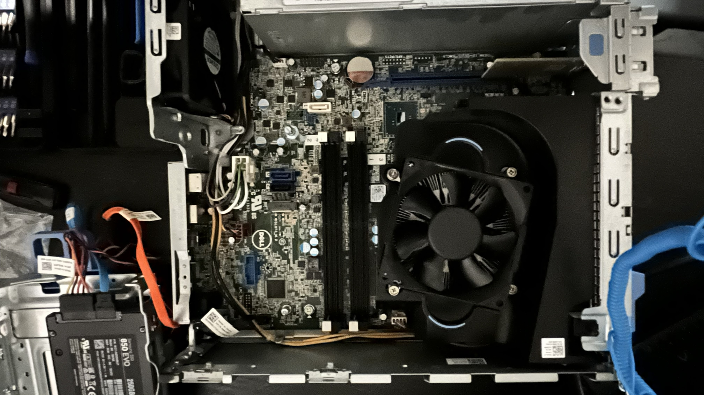
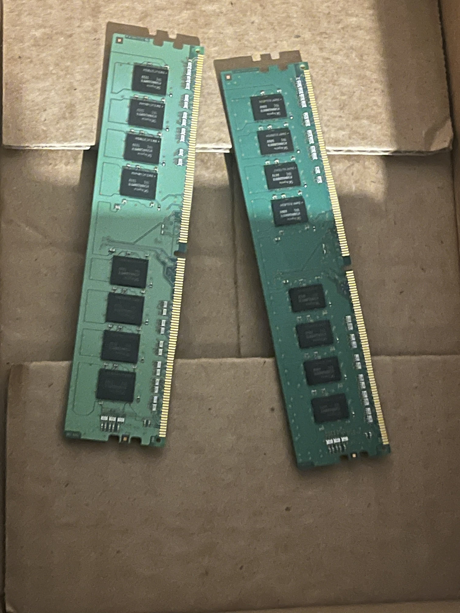

Lab 01: Hardware Acquisition & Initial Diagnostic
Device: Dell OptiPlex 7040 SFF

Scope: Cheap personal work computer.

CPU: Intel Core i5

Manufacture Date: 09-07-2016

Source: Facebook Marketplace ($30)

Initial Inventory
Included: System unit and one C13 power cable.

Seller Claim: "Unit does not power on."

Initial Triage:
Visual Inspection
Checked for physical damage to the chassis and ports. The unit is in surprisingly good condition; there are a few minor scuffs and internal dust, but it is otherwise visually sound.

Power Test
Verified the seller's claim using the provided cable. Result: No signs of life (No LEDs, no fan spin).

Component Isolation
I identified that my monitor uses the same C13 connector as the PC. I swapped the cables to determine if the issue was the internal Power Supply Unit (PSU) or the external cable.

Observation: The PC powered on immediately with the monitor cable.

Observation: The monitor failed to power on using the PC's original cable.

[!IMPORTANT]
Verdict: The C13 power cord was faulty.

Solution: Ordered a replacement power cord ($2).

Phase 2: Diagnostic Boot-Up Failure 
Once the power issue was resolved, the PC powered on but failed to complete the Power-On Self-Test (POST). The power button began flashing an amber/orange pattern.

Technical Research
After researching Dell’s diagnostic codes, I learned that the blink pattern acts as a "Morse code" for hardware failures.

Observed Pattern: 3 amber flashes, a pause, followed by 3 amber flashes (Code 3,3).

Meaning: This code signals No Memory/RAM Detected. My hypothesis was that the RAM modules were either missing completely or seated incorrectly.
The system was currently identifying a memory fault. Since the motherboard was communicating via these codes, the CPU and board were likely healthy (hopefully).

Upon opening the PC, I verified that it was indeed missing RAM, as the slots were all empty.

I ordered two DDR4 RAM sticks off eBay ($30 x 2).

I inserted them into the slots.

The PC powered on.

Specs: Windows 11 Pro, 250 GB SSD, Intel Core i5.

I noticed in the BIOS that the RAM was configured in single-channel instead of dual-channel. I learned that dual-channel is better for efficiency. I originally thought the order did not matter, but it does, so I moved them for optimal performance.

After rearranging the RAM to achieve dual-channel, I plugged in the PC, and no lights came on. Oops...

I unplugged the power cord and held the power button for 60 seconds to discharge the computer, then let it sit for an hour.

It did not start back up.

I removed the CMOS battery to force the motherboard to forget all its temporary settings and reset the BIOS to factory defaults. This clears any stuck error codes or glitches that were preventing the computer from booting up.

After discharging the PC again, I replaced the CMOS battery. Nothing happened. The PC was still dead.

I checked the Built-In Self-Test (BIST) for the power supply on the back of the PC. Nothing happened.

At this point, I wasn't sure what I did wrong. Did I mess up the RAM and cause a short? From my research, I learned that 
the motherboard has a feature to protect itself if there is a short on the RAM.
This can cause the PC to appear dead.

I removed each RAM stick and tried discharging and powering it on with each individual stick, followed by no RAM at all. The PC was still dead. 
(I decided to leave the RAM removed for now.)

I checked the SSD and disconnected the power connector from the motherboard. 
(The SSD receives its power through a SATA Power Header located directly on the motherboard.)

I discharged the PC by unplugging it and holding the power button for 60 seconds again.

Leaving the SSD disconnected from power, I pushed the power button AND THE PC CAME BACK TO LIFE.

Lights were flickering and error codes were flashing, but the PC was alive.

I reconnected the SSD back to the power header, and the PC died again. So, I believe this SSD has a short in it, and the 
Power Supply's Short Circuit Protection (SCP) feature is protecting the rest of the PC from damage.

I read online that an SSD usually lasts 5 to 10 years. Since this was a business PC and is already 10 years old, I am assuming it was on its last legs.

I will be installing a more efficient M.2 NVMe SSD module in the future and reinstalling Windows 11 Pro.

I will be installing a wifi PCIe card as well for convienience, this unit is ethernet only at the moment.

 

